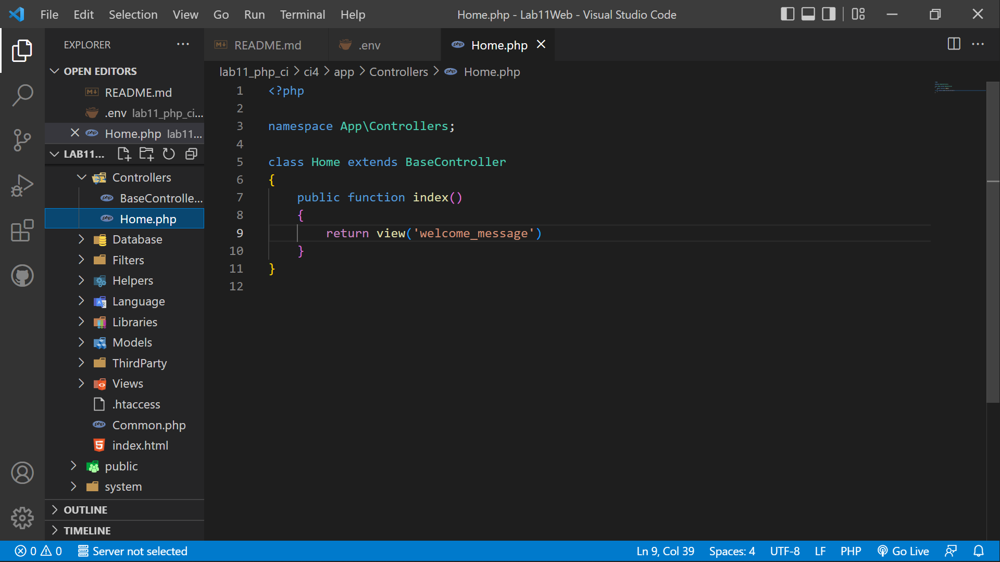
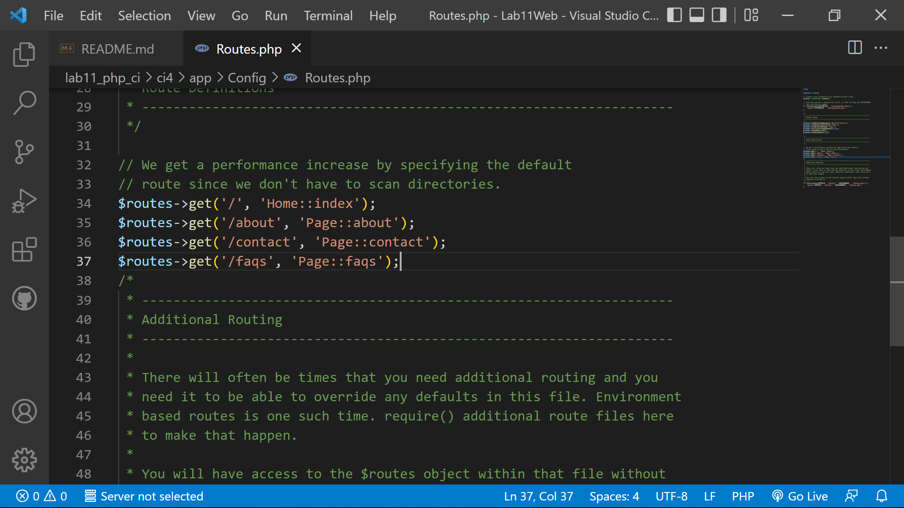
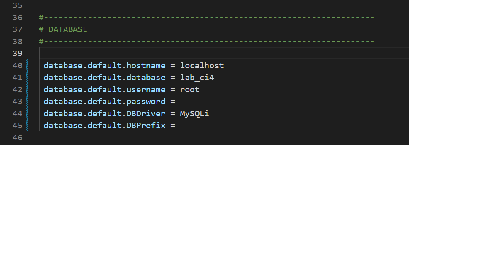

|   Ziddan Makarim  |   TI.20 A.1   |
|-------------------|---------------|
|  Pemrograman Web  |  Praktikum 11 |

# Lab11Web
Dalam praktikum ini kita akan membuat program sederhana menggunakan Framework
Codeigniter 4.

# Langkah - langkah praktikum

## 1). Mengaktifkan ekstentsi tersebut, melalu XAMPP Control Panel, pada bagian apache klik Config -> PHP.ini


## 2). Pada bagian extention, hilangkan tanda ; (titik koma) pada ekstensi yang akan diaktifkan. Kemudian simpan kembali filenya dan restart Apache web server.


## 3). Instalasi Codeigniter 4
Untuk melakukan instalasi Codeigniter 4 dapat dilakukan dengan dua cara, yaitu cara manual dan menggunakan composer. Pada praktikum ini kita menggunakan cara manual.
Buka browser dengan alamat http://localhost/Lab11Web/lab11_php_ci/ci4/public/


## 4). Menjalankan CLI (Command Line Interface)
Menjalankan CLI (Command Line Interface) Codeigniter 4 menyediakan CLI untuk mempermudah proses development. Untuk mengakses CLI buka terminal/command prompt.

Arahkan lokasi direktori sesuai dengan direktori kerja project dibuat
(xampp/htdocs/Lab11Web/lab11_php_ci/ci4)
Perintah yang dapat dijalankan untuk memanggil CLI Codeigniter adalah:
```CLI
php spark
```


## 5). Mengaktifkan Mode Debugging
Codeigniter 4 menyediakan fitur debugging untuk memudahkan developer untuk mengetahui pesan error apabila terjadi kesalahan dalam membuat kode program. Secara default fitur ini belum aktif. Ketika terjadi error pada aplikasi akan ditampilkan pesan kesalahan seperti berikut.


Semua jenis error akan ditampilkan sama. Untuk memudahkan mengetahui jenis errornya, maka perlu diaktifkan mode debugging dengan mengubah nilai konfigurasi pada environment variable CI_ENVIRONMENT menjadi development.


Ubah nama file env menjadi .env kemudian buka file tersebut dan ubah nilai variable CI_ENVIRONMENT menjadi development.


Contoh error yang terjadi. Untuk mencoba error tersebut, ubah kode pada file app/Controller/Home.php hilangkan titik koma pada akhir kode.



## 6). Membuat Routes Baru
Tambahkan code pada routes.php
```php
$routes->get('/about', 'Page::about');
$routes->get('/contact', 'Page::contact');
$routes->get('/faqs', 'Page::faqs');
```



Untuk mengetahui route yang ditambahkan sudah benar, buka CLI dan jalankan
perintah berikut.
```CLI
php spark routes
```


Selanjutnya coba akses route yang telah dibuat dengan mengakses alamat url http://localhost:8080/about


Ketika diakses akan mucul tampilan error 404 file not found, itu artinya file/page tersebut tidak ada. Untuk dapat mengakses halaman tersebut, harus dibuat terlebih dahulu Contoller yang sesuai dengan routing yang dibuat yaitu Contoller Page.

## 7). Membuat Controller
Selanjutnya adalah membuat Controller Page. Buat file baru dengan nama page.php pada direktori Controller kemudian isi kodenya seperti berikut.
```php
<?php

namespace App\Controllers;

class Page extends BaseController
{
    public function about()
    {
        echo "Ini halaman About";
    }
    public function contact()
    {
        echo "Ini halaman Contact";
    }
    public function faqs()
    {
        echo "Ini halaman FAQ";
    }
}
```
Berikut hasil run


## 8). Auto Routing
Secara default fitur autoroute pada Codeiginiter sudah aktif. Untuk mengubah status autoroute dapat mengubah nilai variabelnya. Untuk menonaktifkan ubah nilai true menjadi false.

```php
$routes->setAutoRoute(true);
```
Tambahkan method baru pada Controller Page seperti berikut.

```php
  public function tos()
    {
        echo "ini halaman Term of Services";
    }
```

Method ini belum ada pada routing, sehingga cara mengaksesnya dengan menggunakan
alamat:http://localhost:8080/page/tos


## 9). Membuat View
Selanjutnya adalam membuat view untuk tampilan web agar lebih menarik. Buat file baru dengan nama about.php pada direktori view (app/view/about.php) kemudian isi kodenya seperti berikut.
```html
<!DOCTYPE html>
<html lang="en">
<head>
    <meta charset="UTF-8">
    <title><?= $title; ?></title>
</head>
<body>
    <h1><?= $title; ?></h1>
    <hr>
    <p><?= $content; ?></p>
</body>
</html>
```
Ubah method about pada class Controller Page menjadi seperti berikut:
```php
public function about()
    {
        return view('about', [
            'title' => 'Halaman About',
            'content' => 'Ini adalah halaman about yang menjelaskan tentang isi halaman ini.'
        ]);
    }
```
Refresh halaman tersebut


## 10). Membuat Layout Web dengan CSS
Pada dasarnya layout web dengan css dapat diimplamentasikan dengan mudah pada codeigniter. Yang perlu diketahui adalah, pada Codeigniter 4 file yang menyimpan asset css dan javascript terletak pada direktori public.

Buat file css pada direktori public dengan nama style.css (copy file dari praktikum lab4_layout. Kita akan gunakan layout yang pernah dibuat pada praktikum 4.


Kemudian buat folder template pada direktori view kemudian buat file header.php dan footer.php

File app/views/template/header.php
```html
<!DOCTYPE html>
<html lang="en">
<head>
    <meta charset="UTF-8">
    <title><?= $title; ?></title>
    <link rel="stylesheet" href="<?= base_url('/style.css');?>">
</head>
<body>
    <div id="container">
    <header>
        <h1>Layout Sederhana</h1>
    </header>
    <nav>
        <a href="<?= base_url('/');?>" class="active">Home</a>
        <a href="<?= base_url('/artikel');?>">Artikel</a>
        <a href="<?= base_url('/about');?>">About</a>
        <a href="<?= base_url('/contact');?>">Kontak</a>
    </nav>
<section id="wrapper">
    <section id="main">

```

File app/views/template/footer.php
```html
    </section>
    <aside id="sidebar">
        <div class="widget-box">
            <h3 class="title">Widget Header</h3>
            <ul>
                <li><a href="#">Widget Link</a></li>
                <li><a href="#">Widget Link</a></li>
            </ul>
        </div>
        <div class="widget-box">
            <h3 class="title">Widget Text</h3>
            <p>Vestibulum lorem elit, iaculis in nisl volutpat, malesuada
tincidunt arcu. Proin in leo fringilla, vestibulum mi porta, faucibus felis.
Integer pharetra est nunc, nec pretium nunc pretium ac.</p>
        </div>
    </aside>
</section>
<footer>
    <p>&copy; 2022 - Universitas Pelita Bangsa</p>
</footer>
</div>
</body>
</html>
```
Kemudian ubah file app/view/about.php seperti berikut.
```php
<?= $this->include('template/header'); ?>

<h1><?= $title; ?></h1>
<hr>
<p><?= $content; ?></p>

<?= $this->include('template/footer'); ?>
```
Refresh halaman tersebut


# Praktikum 12: Framework Lanjutan (CRUD)

Membuat program sederhana menggunakan Framework Codeigniter 4.

# Langkah - Langkah Praktikum

## 1). Membuat Database

```MySQL
CREATE DATABASE lab_ci4;
```

## 2). Membuat Tabel

```MySQL
CREATE TABLE artikel (
id INT(11) auto_increment,
judul VARCHAR(200) NOT NULL,
isi TEXT,
gambar VARCHAR(200),
status TINYINT(1) DEFAULT 0,
slug VARCHAR(200),
PRIMARY KEY(id)
);
```

## 3). Konfigurasi Koneksi Database

Selanjutnya membuat konfigurasi untuk menghubungkan dengan database server. Konfigurasi dapat dilakukan dengan du acara, yaitu pada file app/config/database.php atau menggunakan file .env. Pada praktikum ini kita gunakan konfigurasi pada file .env.


## 4). Membuat Model
Selanjutnya adalah membuat Model untuk memproses data Artikel. Buat file baru pada direktori app/Models dengan nama artikelModel.php

```php

```

## 5). Membuat Controller
Buat Controller baru dengan nama Artikel.php pada direktori app/Controllers.

```php

```

## 6). Membuat View
Buat direktori baru dengan nama artikel pada direktori app/views, kemudian buat file baru dengan nama index.php.

```php

```

Selanjutnya buka browser kembali, dengan mengakses url http://localhost:8080/artikel


Belum ada data yang diampilkan. Kemudian coba tambahkan beberapa data pada database agar dapat ditampilkan datanya.

```MySQL
INSERT INTO artikel (judul, isi, slug) VALUE
('Artikel pertama', 'Lorem Ipsum adalah contoh teks atau dummy dalam industri
percetakan dan penataan huruf atau typesetting. Lorem Ipsum telah menjadi
standar contoh teks sejak tahun 1500an, saat seorang tukang cetak yang tidak
dikenal mengambil sebuah kumpulan teks dan mengacaknya untuk menjadi sebuah
buku contoh huruf.', 'artikel-pertama'),
('Artikel kedua', 'Tidak seperti anggapan banyak orang, Lorem Ipsum bukanlah
teks-teks yang diacak. Ia berakar dari sebuah naskah sastra latin klasik dari
era 45 sebelum masehi, hingga bisa dipastikan usianya telah mencapai lebih
dari 2000 tahun.', 'artikel-kedua');
```

Refresh kembali browser, sehingga akan ditampilkan hasilnya.


## 7). Membuat Tampilan Detail Artikel
Tampilan pada saat judul berita di klik maka akan diarahkan ke halaman yang berbeda. Tambahkan fungsi baru pada Controller Artikel dengan nama view().

```php

```

## 8). Membuat View Detail
Buat view baru untuk halaman detail dengan nama app/views/artikel/detail.php.

```php

```

## 9). Membuat Routing untuk artikel detail
Buka Kembali file app/config/Routes.php, kemudian tambahkan routing untuk artikel detail.

```php
$routes->get('/artikel/(:any)', 'Artikel::view/$1');
```


## 10). Membuat Menu Admin
Menu admin adalah untuk proses CRUD data artikel. Buat method baru pada Controller Artikel dengan nama admin_index().

```php

```

Selanjutnya buat view untuk tampilan admin dengan nama admin_index.php

```php

```

Tambahkan routing untuk menu admin seperti berikut:

```php

```